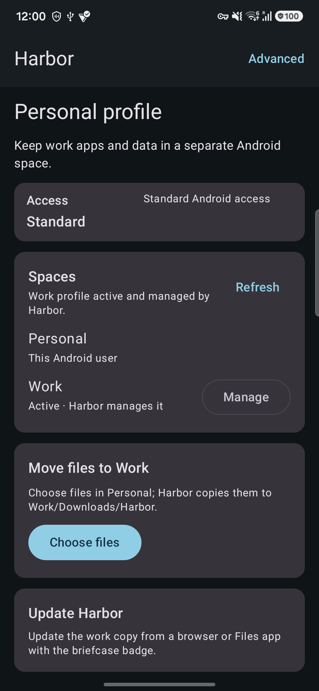
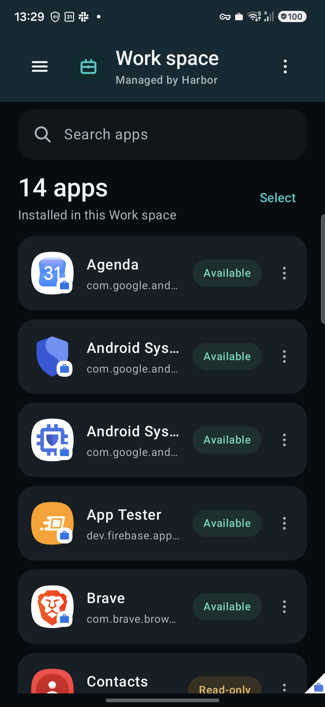

# Harbor

**A private space for Android apps, built on Android's work-profile system.**

Harbor is a free and open-source Android app that creates and manages a standard Android work profile. You can use that profile to keep selected apps and their data separate from your personal side of the phone.

Harbor does **not** require Google Play services, root, a cloud account, analytics, advertising, or Internet access for its core features.

> **Harbor is alpha software.** Use it for testing and non-critical data while device compatibility is still being expanded.

## What can I do with Harbor?

- Create a standard Android work profile.
- See the apps installed inside the work profile.
- Search and launch work apps.
- Freeze and unfreeze eligible apps.
- Open Android's app-details screen or uninstall apps.
- Create launcher shortcuts for work apps.
- Send files from your personal profile into the work profile.
- Prepare APK installs while keeping Android's normal security/consent prompts.
- Optionally use Shizuku for advanced diagnostics, package cloning, and experimental additional workspaces.

The normal work-profile features do **not** require Shizuku.

## Screenshots

<p align="center">
  
  
</p>

<p align="center"><sub>Harbor running on a Samsung Galaxy S24 with Android 16 (API 36).</sub></p>

## How it works

Android work profiles are separate spaces managed by the operating system. Apps inside the work profile have their own app data and appear with Android's work badge.

Harbor uses Android's supported `DevicePolicyManager` APIs to create and manage that profile. The Harbor copy inside the work profile becomes the profile owner and performs management actions locally.

Harbor does not try to bypass Android's security model with hidden APIs, automatic `dpm set-profile-owner`, root commands, or a general-purpose shell.

### One work profile per Android user

Stock Android generally allows **one managed work profile per parent Android user**.

If Harbor shows:

> Another profile exists and Android does not currently allow another work profile

that means Android has reported that the current user cannot create another managed profile. This commonly happens when a work profile already exists from an employer, another DPC, Island, Shelter, or a similar app.

Harbor intentionally respects this platform limit instead of trying to bypass it.

## Getting started

1. Install Harbor.
2. Open Harbor on the personal side of the phone.
3. Tap **Create Work space**.
4. Follow Android's work-profile setup screens.
5. Open the work-badged Harbor app to manage apps inside the new profile.

Harbor is intended for distribution through **F-Droid**. Until the F-Droid build is accepted, the latest alpha builds are available from [GitHub Releases](https://github.com/Stem0794/harbor/releases/latest).

The GitHub release currently includes a Monstera-signed APK for testing and an unsigned reproducible artifact for F-Droid/upstream verification. A future F-Droid build will use F-Droid's signing key, so a GitHub-signed installation may not upgrade directly to the F-Droid-signed package.

Do not use an alpha build for a work profile containing irreplaceable data.

## Personal to work file sharing

Harbor supports sending files **from Personal to Work**.

You can either:

- open Personal Harbor from the work side and choose files, or
- use Android's Share menu from a personal app and select the work-badged Harbor app.

Harbor copies the selected file into:

```text
Downloads/Harbor
```

inside the work profile. The original personal file is not deleted.

Android uses generic cross-profile share filters, so other compatible work apps may also appear as possible recipients. Harbor warns about this before enabling the sharing flow.

Harbor does not provide a work-to-personal export flow.

## Privacy

Harbor is designed to work locally.

- No `INTERNET` permission.
- No analytics or telemetry.
- No advertising.
- No account system.
- No Firebase or Google Play services dependency.
- No remote configuration.
- App and user diagnostics stay on the device.

Harbor declares Android's `QUERY_ALL_PACKAGES` permission because its core app-management screen needs to enumerate the applications installed in the **local work profile**. Android 11 and newer otherwise filter package visibility. This permission lets Harbor build its local app catalog; it does not grant access to another app's private data, Internet access, or arbitrary cross-user access.

See [Privacy](docs/PRIVACY.md) and [Threat model](docs/THREAT_MODEL.md) for the full details.

## Shizuku and advanced tools

Shizuku is optional and must be installed and started separately by the user.

When Advanced tools are enabled, Harbor can use a small allowlisted privileged backend to:

- show local diagnostics,
- attempt `install-existing` package cloning,
- list Android users,
- create a secondary full Android user where supported,
- install Harbor for that user, and
- switch users.

There is no arbitrary command console. Harbor validates package names and user IDs and fails closed when the device topology cannot be determined safely.

Shizuku behavior varies considerably by Android version and OEM. A running Shizuku server does not guarantee that every advanced operation is available.

## Multiple workspaces

Android normally allows one managed profile for each parent full user. Harbor's experimental multi-workspace model therefore uses additional full Android users:

```text
Primary Android user
└── Harbor work profile

Secondary Android user A
└── Harbor work profile

Secondary Android user B
└── Harbor work profile
```

This feature is experimental and depends on OEM support. Harbor intentionally does not implement full-user deletion because deleting an Android user destroys its personal and work-profile data.

## Compatibility

Harbor targets Android 10 through Android 16 (API 29-36), but work-profile provisioning and device-policy behavior can differ between manufacturers.

### Physical devices tested

- Samsung Galaxy S24

The OnePlus 13 remains planned secondary coverage and has not been tested yet.

See [Compatibility](docs/COMPATIBILITY.md) for emulator results, device-specific limitations, and the remaining physical-device test matrix.

## Current release

Current release line: **0.2.0-alpha05**

The core work-profile path includes:

- managed-profile provisioning and profile-owner detection,
- searchable work-app catalog,
- app launch/details/uninstall,
- freeze/unfreeze,
- batch operations,
- work-app launcher shortcuts,
- personal-to-work file sharing, and
- local lifecycle/recovery handling.

Advanced Shizuku operations, secondary-user workspaces, some launcher behavior, and some OEM-specific flows remain experimental.

## For developers

### Requirements

- JDK 17
- Android SDK Platform 36
- Android Build Tools 36.0.0

### Build and verify

```shell
./gradlew testDebugUnitTest lintDebug assembleRelease
./gradlew generateSbom
```

Debug builds use `com.monstera.harbor.debug` and cannot update production/F-Droid installations.

Production identity:

```text
Application ID: com.monstera.harbor
DPC receiver:   com.monstera.harbor.admin.HarborDeviceAdminReceiver
```

These identities, together with the production signing identity, are update-compatibility contracts.

### Project structure

```text
app/                    Compose UI, DPC receiver, manifests
core/policy/            Public DevicePolicyManager facade
core/data/              Local app catalog and preferences
core/topology/          Users, profiles, ownership, capabilities
privileged/shizuku/     Isolated Shizuku UserService backend
feature/advanced/       Shizuku and multiple-user UI
build-logic/            Shared Gradle conventions
docs/                   Architecture, privacy, threat model, release guidance
packaging/fdroid/       F-Droid metadata and build recipe
```

Before contributing, read:

- [Architecture](docs/ARCHITECTURE.md)
- [Threat model](docs/THREAT_MODEL.md)
- [Compatibility](docs/COMPATIBILITY.md)
- [Dependencies](docs/DEPENDENCIES.md)
- [Releasing](docs/RELEASING.md)

Changes to the core DPC path should remain independent from Shizuku and avoid hidden APIs, privileged permissions, arbitrary commands, network telemetry, and proprietary dependencies.

## License

Apache License 2.0.

Harbor is behaviorally inspired by Island, but it is a clean implementation with its own application identity and public-API-first architecture.
