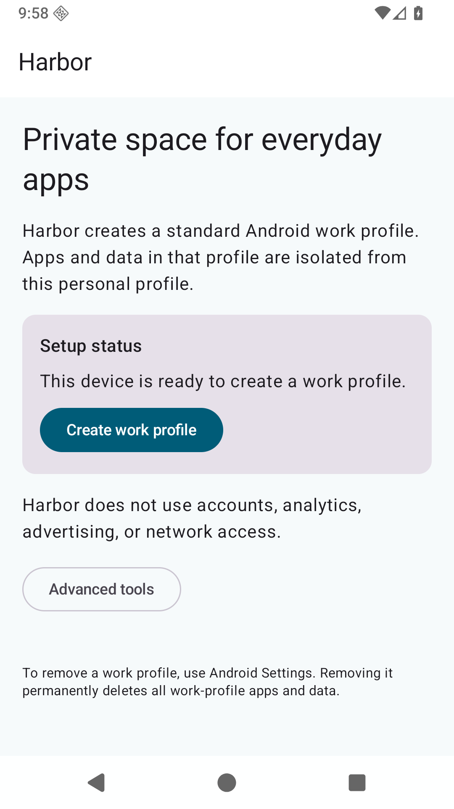
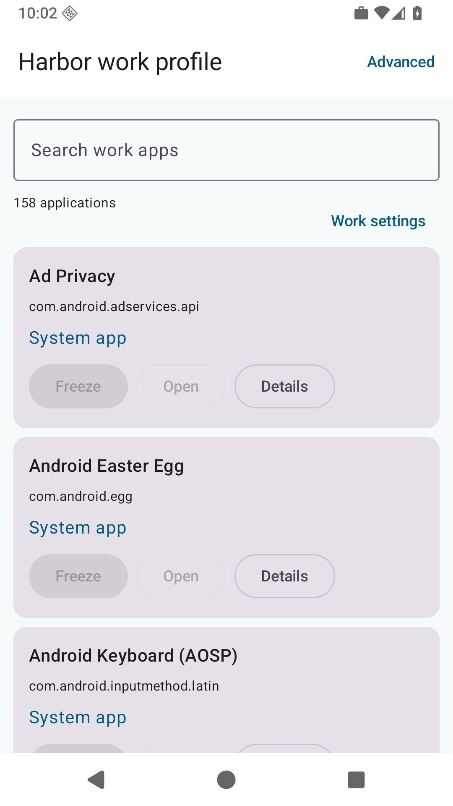

# Harbor

Harbor is a free and open-source Android application for creating and managing a standard Android work profile. It is designed for people who want a practical isolation boundary for apps and data without depending on Google Play services, root, or a cloud account.

> Harbor is alpha software. The core flow is implemented and tested on AOSP Android 16, but provisioning and Device Policy Controller behavior still need broader physical-device validation before a stable release.

## What Harbor does

- Creates one consent-based managed work profile for the current Android user.
- Detects whether the local Harbor instance owns the profile.
- Lists applications installed in that work profile.
- Searches the local application catalog.
- Launches apps and opens their Android system details page.
- Freezes and unfreezes eligible apps with `DevicePolicyManager.setApplicationHidden`.
- Starts system-confirmed uninstall flows for non-system apps.
- Explains when Android Settings must be used for work-profile toggles or removal.
- Lets the user prepare APK installation while retaining Android's per-source consent prompt for the app that opened the APK.
- Provides a supported personal-to-work file flow: tap `Pick from personal files` in work Harbor, or use the personal profile's Share action and choose Harbor with the work badge. Harbor copies the file into work-profile `Downloads/Harbor` without deleting the personal original.
- The sharing policy is applied by the Harbor instance inside the work profile. When testing an update, update/open that work-badged Harbor copy; installing only the personal-profile copy does not change the active profile owner.
- Provides optional Shizuku developer tools for diagnostics, allowlisted package cloning, and experimental multi-user workspaces.

The core DPC path works without Shizuku. Advanced tools are opt-in and are never required to provision or manage the primary work profile.

## Screenshots

The following screenshots were captured from the API 36 AOSP emulator during the MVP validation flow.

| Work-profile setup | Local work-profile app catalog |
| --- | --- |
|  |  |

The screenshots show the current public-API MVP. OEM Settings screens, work-profile launchers, and Shizuku behavior can look different on real devices.

## Design principles

Harbor deliberately stays close to supported Android APIs:

- Public `DevicePolicyManager` APIs for profile-owner operations.
- No hidden API reflection, direct `su`, or arbitrary shell console.
- No automated `dpm set-profile-owner` or consent bypass.
- No Firebase, Google Play services, analytics, crash reporting, advertising, account system, or remote configuration.
- No network permission in the core application.
- Local app and user diagnostics remain on the device.
- Shizuku commands use a fixed operation allowlist, validated package/user identifiers, bounded output, and no command-string concatenation.

Harbor is behaviorally inspired by Island, but it is a clean implementation with a new application identity and a public-API-first architecture.

## Current status

The current release line is `0.2.0-alpha03`.

Implemented:

- API 29 through API 36 build configuration.
- Standard managed-profile provisioning and profile-owner detection.
- Lifecycle and recovery states for the primary work profile.
- Searchable work-profile catalog, launch, details, freeze/unfreeze, and uninstall flows.
- Lazy app icons with a generic fallback, multi-selection, sequential batch freeze/unfreeze, and partial-failure reporting.
- UUID-scoped work-profile launcher shortcuts that unfreeze and launch a validated local target.
- A conservative workspace dashboard with optional aliases/icons and stale Android-user metadata handling.
- Optional Shizuku backend with diagnostics, allowlisted `install-existing`, full-user listing, creation, Harbor installation, and switching primitives.
- Reproducible Gradle conventions, dependency verification, SBOM generation, and F-Droid packaging scaffolding.

Still experimental or device-dependent:

- Shizuku ADB-mode package cloning on Android 16 and OEM builds.
- Multiple full-user workspaces and provisioning a work profile inside a secondary user.
- Launcher pinning and shortcut behavior across Pixel, Samsung, Xiaomi, and other OEM launchers.
- API 29 provisioning on emulator images without device encryption.
- OEM-specific launchers, Settings flows, process killing, user switching, and package-manager permissions.

See [the compatibility matrix](docs/COMPATIBILITY.md) for the evidence and required physical-device gates.

## Application identity

- Production application ID: `com.monstera.harbor`
- Debug application ID: `com.monstera.harbor.debug`
- DPC receiver: `com.monstera.harbor.admin.HarborDeviceAdminReceiver`

The production application ID, DPC receiver component, and release signing identity are update-compatibility contracts. They must remain stable once a public distribution build is shipped.

## Installation

Harbor is intended for F-Droid distribution rather than Google Play. Until the first F-Droid build is accepted, use the GitHub source and release artifacts only for development and testing.

The GitHub release includes two APK artifacts. The Monstera-signed APK is convenient for alpha testing; the unsigned APK is the upstream/F-Droid reproducibility artifact. F-Droid is expected to build the tagged source and sign the production package with its own signing key. A Monstera-signed installation will not be upgradeable from a future F-Droid-signed installation unless the signing arrangement is explicitly coordinated, so choose one distribution channel for a given device. Do not use an alpha APK for a profile that contains irreplaceable data.

For local development:

1. Install a JDK 17 and Android SDK Platform 36.
2. Enable USB debugging on a disposable test device or start an AOSP emulator.
3. Build the debug APK with `./gradlew assembleDebug`.
4. Install it with `adb install app/build/outputs/apk/debug/app-debug.apk`.
5. Provision the work profile through Harbor and the Android consent screens.

Debug builds use a separate application ID and cannot update production/F-Droid installations.

## Shizuku integration

Shizuku is optional and must be installed and activated separately by the user. Harbor does not bundle, download, start, or update the Shizuku manager.

When enabled under Advanced, Harbor can:

- Report Shizuku availability, server version, permission state, and effective UID.
- Show redacted local user/profile/package-manager diagnostics.
- Attempt allowlisted `install-existing` cloning into the existing Harbor work profile.
- List and create secondary full Android users where the device supports it.
- Install Harbor for a secondary user and guide the user through normal work-profile provisioning there.

ADB-shell and root-backed Shizuku use the same Harbor operation allowlist. A root UID does not automatically unlock additional commands. Android/OEM capability checks are performed per operation.

## Multiple workspaces

Stock-compatible Android guarantees at most one managed profile per parent full user. Harbor therefore models multiple workspaces as:

```text
Primary full user
└── One Harbor work profile

Secondary full user A
└── One Harbor work profile

Secondary full user B
└── One Harbor work profile
```

Switching full users is a platform-level operation; remote users cannot be managed as if they were visible inside the primary user. User creation consumes storage, may be disabled by an OEM, and is experimental. User deletion is intentionally not implemented because it destroys personal and work-profile data.

## Build from source

Requirements:

- JDK 17
- Android SDK Platform 36
- Android Build Tools 36.0.0

Common verification commands:

```shell
./gradlew testDebugUnitTest lintDebug assembleRelease
./gradlew generateSbom
```

The build resolves dependencies only from Google Maven, Maven Central, and the Gradle Plugin Portal. Dependency verification and lockfiles are committed. See [the dependency audit](docs/DEPENDENCIES.md) for licenses and the optional Shizuku dependency.

## Repository layout

```text
app/                    Compose UI, DPC receiver, manifests
core/policy/            Public DevicePolicyManager facade
core/data/              Local app catalog and preferences
core/topology/          Users, profiles, ownership, capabilities
privileged/shizuku/     Isolated Shizuku UserService backend
feature/advanced/       Shizuku and multiple-user UI
build-logic/            Shared Gradle conventions
docs/                   Architecture, privacy, threat model, release guidance
packaging/fdroid/       Candidate F-Droid metadata
```

## Privacy and security

Harbor has no telemetry and no network permission. The app catalog is read from the local Android package manager and is not uploaded. Shizuku diagnostics are local and only run after the user explicitly enables Advanced tools and grants Shizuku permission.

The most important security boundary is Android's work-profile and profile-owner model. Harbor does not claim that it can bypass OEM restrictions, inspect remote users authoritatively, or transfer ownership from Island/Insular. Removing a work profile or full user through Android Settings is destructive.

Read [Privacy](docs/PRIVACY.md) and [Threat model](docs/THREAT_MODEL.md) before testing on a device with important data.

## Compatibility and testing

Automated checks cover JVM tests, compilation, lint, release assembly, and manifest/security tests where available. Emulator validation covers AOSP API 36 and API 29 constraints. Before a stable release, the project requires physical testing on a current Pixel, an Android 10 reference device, Samsung, Xiaomi, an Oppo/Realme/Vivo device, and a GMS-free build.

Known limitations include OEM provisioning failures, one-managed-profile-per-parent limits, work profiles inside secondary users, Shizuku process death, package-manager permission differences, and launcher-specific behavior.

See [Compatibility](docs/COMPATIBILITY.md) and [Releasing](docs/RELEASING.md).

## Contributing

Small, focused contributions are welcome. Please:

1. Read [Architecture](docs/ARCHITECTURE.md), [Threat model](docs/THREAT_MODEL.md), and [Compatibility](docs/COMPATIBILITY.md).
2. Keep the core DPC path independent from Shizuku.
3. Avoid hidden APIs, privileged permissions, arbitrary commands, network telemetry, and proprietary dependencies.
4. Add or update tests for policy, topology, parser, and privileged-command changes.
5. Run the verification commands above and report the Android/OEM device used for manual testing.

## License

Apache License 2.0. Harbor is inspired by Island, but is a new implementation and does not use Island's legacy module or privileged-service architecture.
